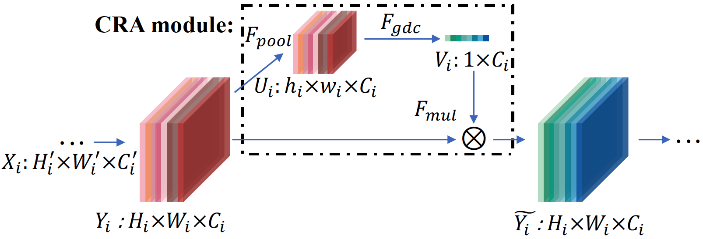

# Channel Reassessment Attention Module

The implementation for Channel Reassessment Attention (CRA) module. 

## Approach

  The architecture of CRA module.

## Performance on ImageNet-1K
| model                |top-1 error |top-5 error |FLOPs  |params |
| ----                 | ----     | ----      | ----     |-----|
| ResNet-50           | 24.20       | 7.15      | 4.11G      |25.56M|
| CRA-ResNet-50             | **22.77**        | **6.47**         | 4.11G        |26.31M|
| ResNet-101           | 23.12       | 6.67       | 7.84G      |44.55M|
| CRA-ResNet-101             | **21.60**        | **5.93**         | 7.84G        |46.17M|
| ResNeXt-101           | 21.27       | 5.79       | 8.01G      |44.18M|
| CRA-ResNeXt-101             | **20.71**       | **5.47**         | 8.02G        |45.80M|

